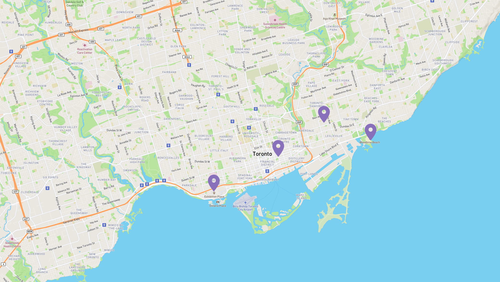

# MAP-POI

## Description

<p>Pin your favourite point of interests with<b>Map-POI!</b></p>
<p>Full-stack application built using JavaScript, React, Express, NodeJS, MongoDB (MERN) and Mapbox.</p>

## Preview

<p>Main Page</p>


### Tech stack

```
Core:
- JavaScript
- React
- Express
- Node.JS
- MongoDB
- Mongoose

- Mapbox
```

## Available Scripts

In the backend directory, open the app with:

### `npm start`

Open [http://localhost:8080](http://localhost:8080) to view it in your browser.

The page will reload when you make changes.
You may also see any lint errors in the console.
